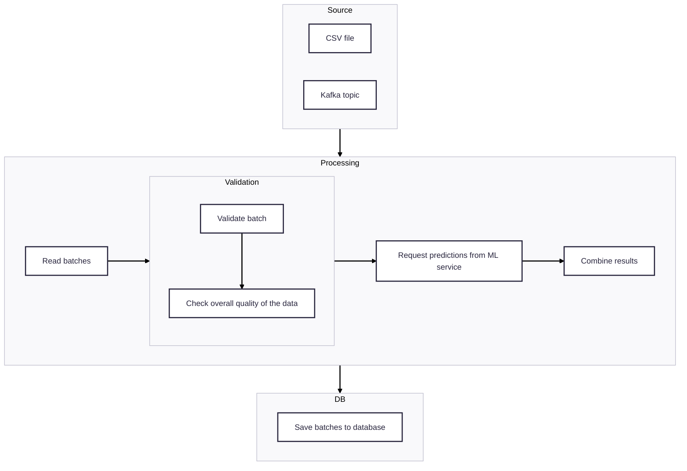
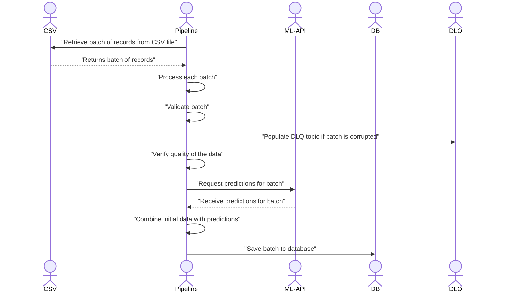
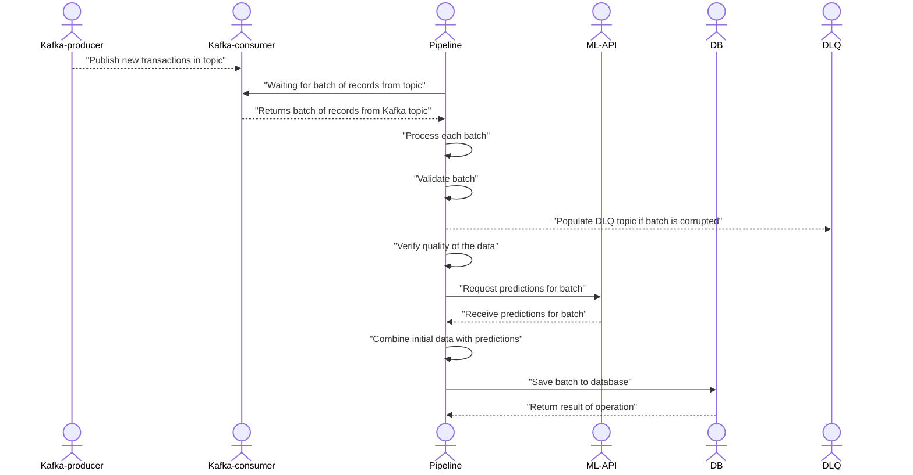

# Data Engineer Skill Test

First of all, thanks a lot for taking the time to go through this case. We know your time is valuable, and we really appreciate your commitment.
For this test, you'll be building 2 pipelines to get incoming transactions categorized.


## Instructions

The objective of this skill test is to assess how you would build a simple, and reliable pipelines to
ingest data from a CSV file, ask predictions to a ml service, and store results to DB. The ML API has already been bootstrapped, and you can find
some code available in the `ml_api` folder.

We are asking you to build a solution, that can both read data as batch from a CSV file, and consume data in real-time with Kafka.

Additional Information:
 - An example of how to test the API is described in the last section of this README. 
 - There is a CSV file with 10k transactions that you can find in the `data` folder.
 - Use any library or framework you want to build the pipeline
 - Use any database you want to store the results
 - Update the `docker-compose.yml` file to add any additional services you need 
 - Revamp the `ml_api` if you want to add more code, tests, etc. Just keep the same prediction logic, i.e. ```category=CATEGORIES[hash(transaction.id) % len(CATEGORIES)]```
 - Feel free to add data quality, validation, and any observability tools that you think could be useful
 - Think about how to make the pipelines resilient, scalable, and flexible.


### Requirements

Expected items to deliver: 
 - **A Python service running end-to-end that will process the CSV file as batch and in real time**, call the ml service, and store results to a DB. **The two pipelines must be resilient, scalable, and maintainable**.
 - A note/README section on how to run the 2 different pipelines batch, and real-time (Kafka).
 - A note/README to explain the design choices you made, and what you had in mind, but lacked time to implement it.
Feel free to add any diagrams or notes that you think are relevant.

   
## Running the Service

### Prerequisites

- Docker & Docker Compose installed on your machine

### Installation

To help you get predictions, we have provided a very simple ml prediction system that given
a transaction, will return a category based on it's hashed id.

1. Start Docker
2. Run ```docker-compose up --build``` in the root directory of the project
3. Server should be running on http://localhost:8000
4. You can test to send a payload on the `/predict` endpoint this way:
    ```bash
    curl -X POST http://localhost:8000/predict \
      -H "Content-Type: application/json" \
      -d '{
          "id": "b9fa6684-502b-4695-8f92-247432ba610d",
          "description": "Weekly grocery shopping at Whole Foods",
          "amount": 100,
          "timestamp": "2023-04-15T14:30:00",
          "merchant": "Whole Foods Market",
          "operation_type": "card_payment",
          "side": "credit"
      }'
    ```

# Report

## Requirements

In order to run the project, it is necessary to install

* [Docker](https://www.docker.com/)
* [docker-compose](https://docs.docker.com/compose/)
* [uv](https://docs.astral.sh/uv/)
* [Make](https://www.gnu.org/software/make/)

## Overview (brief)

* Execution commands for pipelines are located under `pipelines/scripts` folder
* Add `notebooks/eda.ipynb` for sake of data visibility
* For error handling, implemented [dead letter queue](https://aws.amazon.com/what-is/dead-letter-queue/)
* Most of the services in [docker-compose.yaml](docker-compose.yaml) are provided with separate UI tool

## Tech stack


## Architecture

### Overall



### CSV ingestion sequence



### Kafka ingestion sequence



### Ingestion service classes

* [pipelines/services/batch_ingest.py](./pipelines/services/batch_ingest.py)

```mermaid
classDiagram
direction TB

class TransactionRequest {
  UUID id
  string description
  float amount
  datetime timestamp
  string | null merchant
  string operation_type
  string side
}

class PredictionResponse {
  UUID transaction_id
  string category
}

class CSVReader {
  str file_path
  read_batches(int chunk_size) Iterator~pd.DataFrame~
}

class MLServiceProtocol {
  predict(List~TransactionRequest~) List~PredictionResponse~
}
<<interface>> MLServiceProtocol

class MLPredictService {
  string url
  _post(string path, object json) requests.Response
  predict(List~TransactionRequest~) List~PredictionResponse~
}

class BatchQuality {
  float threshold
  verify(pd.DataFrame df) QualityReport
}

class QualityReport {
  float issues_rate
}

class DLQPublisher {
  publish(dict original, string err, string stage, string source, string topic) awaitable
}

class TransactionValidator {
  validate_rows(pd.DataFrame rows) Dict~string, pd.DataFrame~
}

class TransactionRepository {
  upsert_many(List~Dict~string, Any~~ rows) awaitable~int~
}

class AbstractTransactionIngestService {
  async_sessionmaker~AsyncSession~ session_factory
  MLServiceProtocol ml_api
  BoundLogger logging
  BatchQuality quality_service
  DLQPublisher dlq
  __post_init__() None
  read_batches(int chunk_size) AsyncIterator~pd.DataFrame~*
  source() str*
  run() awaitable~int~
}
<<abstract>> AbstractTransactionIngestService

class CSVTransactionIngestService {
  CSVReader csv_reader
  source() str
  read_batches(int chunk_size) AsyncIterator~pd.DataFrame~
}

class KafkaTransactionIngestService {
  AIOKafkaConsumer consumer
  source() str
  read_batches(int chunk_size) AsyncIterator~pd.DataFrame~
}

AbstractTransactionIngestService <|-- CSVTransactionIngestService
AbstractTransactionIngestService <|-- KafkaTransactionIngestService

MLServiceProtocol <|.. MLPredictService

CSVTransactionIngestService --> CSVReader
KafkaTransactionIngestService --> AIOKafkaConsumer

AbstractTransactionIngestService --> MLServiceProtocol
AbstractTransactionIngestService --> BatchQuality
AbstractTransactionIngestService --> DLQPublisher
AbstractTransactionIngestService ..> TransactionValidator : validate_rows()
AbstractTransactionIngestService ..> TransactionRepository : upsert_many()

MLServiceProtocol ..> TransactionRequest
MLServiceProtocol ..> PredictionResponse

BatchQuality --> QualityReport
```



## Project structure

```
── alembic.ini                              <- Alembic configuration file                 
├── data
│   └── transactions_fr.csv                 <- Initial CSV data
├── docker-compose.yml                      <- Docker services
├── Dockerfile                              <- Docker file for all pipelines
├── infra                                   <- Infrastructure files (requires for docker compose services)
│   ├── grafana                             <- Grafana-related configs
│   │   ├── dashboards
│   │   │   ├── ingest-dashboard.json       <- Metrics dashboard
│   │   │   └── logs-dashboard.json         <- Dashboard for displaing application logs (via Loki)
│   │   └── provisioning
│   │       ├── dashboards
│   │       │   └── dashboards.yml          <- Config for dashboards' source
│   │       └── datasources
│   │           └── datasources.yaml        <- Datasources for dashboards
│   ├── kafka                               <- Kafka-related configs
│   │   ├── schema-registry
│   │   │   ├── dlqs_v1.avsc                <- Schema of 'dlq' topic in avro
│   │   │   └── transactions_v1.avsc        <- Schema of 'transactions' topic in avro
│   │   └── scripts
│   │       ├── init-kafka-topics.sh        <- Bash script for initialization of kafka topics
│   │       └── register-schemas.sh         <- Bash script for registering avro schemas
│   ├── loki                                <- Loki-related configuraiton files
│   │   └── config.yml
│   ├── pgadmin                             <- PGAdmin-related configuraiton files
│   │   ├── pgpass
│   │   └── servers.json                    <- Preinstalled list of services for quick access
│   ├── prometheus                          <- Prometheus-related config files
│   │   └── prometheus.yml
│   └── promtail                            <- Promtail(application logs collector)-related config file
│       └── config.yml
├── Makefile                                <- Commands for quick project run
├── ml_api                                  <- Predefine machine learning service
│   ├── Dockerfile
│   ├── requirements.txt
│   └── src
│       ├── main.py
│       └── models.py
├── notebooks
│   └── eda.ipynb                           <- Jupyter notebook for exploratory data analysis
├── pipelines                               <- Main application package
│   ├── alembic                             <- Alembic-related configuration files
│   │   ├── env.py
│   │   ├── README
│   │   ├── script.py.mako
│   │   └── versions                                      <- Alembic migrations
│   │       └── a74acd1e70a4_create_transactions_table.py <- Create transactions table
│   ├── config.py                                         <- Application configuration file
│   ├── csv
│   │   └── reader.py                                     <- CSV reader class
│   ├── db
│   │   ├── models.py                                     <- Database models
│   │   └── repository.py                                 <- Repository for inserting transactions
│   ├── kafka                                             <- Package for Kafka ingestion pipeline
│   │   └── producers
│   │       └── dlq.py                                    <- DLQ publisher
│   ├── logging.py                                        <- Configuration of logging
│   ├── observability                                     <- Package for observability implementation
│   │   ├── http_app.py                                   <- FastAPI application for sending metrics from csv / kafka ingestion scripts
│   │   ├── metrics.py                                    <- Definition of necessary metrics
│   │   └── utils.py                                      <- Utility functions (related to writing metrics from file)
│   ├── scripts                                           <- Package for pipelines execution
│   │   ├── csv.py                                        <- CSV ingestion pipeline
│   │   └── kafka
│   │       ├── consumer.py                               <- Kafka consumer run command
│   │       └── producer.py                               <- Kafka producer run command
│   └── services                                          <- Package for services setup
│       ├── backoff.py                                    <- Implementation of expotential backoff for third-party service (ml-api)
│       ├── batch_ingest.py                               <- Main service for ingestion of transactions
│       ├── errors.py                                     <- Common service errors
│       ├── ml_api.py                                     <- ML API service client
│       ├── models.py                                     <- Common models
│       ├── protocols.py                                  <- Definition of protocols (since there are no interfaces in Python)
│       ├── quality.py                                    <- Verification of data quality
│       ├── utils.py                                      <- Service-related utils function
│       └── validator.py                                  <- Data validation
├── pyproject.toml                                        <- Project configuration file with package metadata
├── pytest.ini                                            <- Config file for pytest
├── README.md                                             <- Initial task
├── test_main.http                                        <- ML API testing example
├── tests                                                 <- Tests folder (unit-/integration-/e2e-/functional-) 
│   ├── db                                                <- Tests for 'db' package
│   │   ├── test_repository_integration.py                <- Integration (database-layer) tests
│   │   └── test_repository.py                            <- Functional (whole stack) tests
│   ├── functional
│   │   ├── test_consumer.py                              <- Tests for Kafka consumer pipeline
│   │   └── test_csv.py                                   <- Tests for CSV ingestion pipeline
│   ├── pipelines
│   │   └── csv
│   │       └── test_reader.py                            <- CSVReader class tests
│   └── services
│       ├── test_csv_service_e2e.py                       <- End-to-end tests for CSV service
│       ├── test_kafka_service_e2e.py                     <- End-to-end tests for Kafka service
│       ├── test_kafka_service.py                          <- Unit tests for Kafka service
│       ├── test_ml_api.py                                 <- Unit tests for ML API client
│       ├── test_quality.py                                <- Unit tests data quality
│       ├── test_transaction_ingest_service.py             <- Unit tests transaction ingestion common class
│       └── test_transaction_validator.py                  <- Unit tests validation
```

## `docker-compose.yaml` services

* `ml-api` - initial service; Represents external machine learning service for predictions
* Database
  * `postgres` - Primary relational database (PostgreSQL).
  * `pgadmin` - Web-based UI for PostgreSQL administration.
* Kafka
  * `zookeeper` - Coordination service for Kafka cluster. Manages broker metadata, leader election, and cluster state.
  * `kafka` - Apache Kafka broker. Acts as the message bus for streaming transactions between producers and consumers.
  * `schema-registry` - Confluent Schema Registry. Stores and validates message schemas (e.g. Avro/JSON Schema) to ensure compatibility between producers and consumers.
  * `console` Redpanda Kafka UI. Provides web interface to inspect topics, messages, consumer groups, and schemas
  * `init-topics` - One-off initialization job. Creates required Kafka topics at startup if they do not exist.
  * `register-schemas` - One-off initialization job. Registers message schemas in Schema Registry before producers/consumers start.
* Task
  * `csv-ingestion` - Batch ingestion job. Reads transactions from CSV files, enriches them via ml-api, and persists results into PostgreSQL.
  * `consumer` - Kafka consumer command. Continuously reads transactions from Kafka, enriches them via ml-api, and writes results to PostgreSQL.
  * `producer` - Kafka producer command. Reads transactions from CSV files and publishes them in topic
* Observability
  * `prometheus` - Metrics collection and storage system. Scrapes application metrics (ingestion, Kafka consumer, ML latency, DB timings) and stores time series data.
  * `grafana` - Visualization and observability UI. Used to explore metrics (Prometheus) and logs (Loki) via dashboards.
  * `loki` - Log aggregation backend. Stores structured logs from all services and allows querying by labels (service, level, source, etc.).
  * `promtail` - Log shipping agent. Collects logs from Docker containers, enriches them with labels, and forwards them to Loki.

## `Makefile` commands

* `mypy` - Run [mypy](https://mypy.readthedocs.io/en/stable/) typing check
* `black` - [Black](https://pypi.org/project/black/) linter
* `black-fix` - Black linter with fixes
* `ruff` - [Ruff](https://docs.astral.sh/ruff/) linter
* `lint` - `mypy` + `black-fix` + `ruff`
* `unit-tests` - Execute unit tests
* `integration-tests` - Run integration tests
* `e2e-tests` - Run functional + e2e tests 
* `test-coverage` - Show project's test coverage
* `csv-ingestion` - Run csv ingestion pipeline
* `kafka-consumer` - Run Kafka consumer pipeline
* `kafka-producer` - Run Kafka producer command. Made for the ease of testing Kafka consumer pipeline
* `postgres` - Run postgres-related containers in docker compose
* `kafka` - Run kafka-related containers in docker compose
* `observability` - Run observability-related containers in docker compose

## Tests

* There are 4 types of tests in the project:
  * `Unit` - mock external calls. Marked as `@pytest.mark.unit` in code
  * `Integration` - verify work of database-related elements. Marked as `@pytest.mark.integration` in code
  * `End-to-end` - service + database connection. Marked as `@pytest.mark.e2e` in code
  * `Functional` - check the whole stack, spins up the docker services from `docker-compose`. Marked as `@pytest.mark.functional` in code

### Test coverage

* **Note:** Functional tests are excluded from coverage

```
============================================== tests coverage ==============================================
_____________________________ coverage: platform darwin, python 3.12.6-final-0 _____________________________

Name                                    Stmts   Miss  Cover   Missing
---------------------------------------------------------------------
pipelines/__init__.py                       0      0   100%
pipelines/config.py                        14      0   100%
pipelines/csv/__init__.py                   0      0   100%
pipelines/csv/reader.py                    15      0   100%
pipelines/db/models.py                     19      0   100%
pipelines/db/repository.py                 16      0   100%
pipelines/kafka/__init__.py                 0      0   100%
pipelines/kafka/producers/__init__.py       0      0   100%
pipelines/kafka/producers/dlq.py           32     19    41%   10, 17-27, 49-73
pipelines/logging.py                       13     13     0%   1-38
pipelines/observability/__init__.py         0      0   100%
pipelines/observability/http_app.py        44     44     0%   1-72
pipelines/observability/metrics.py         13      0   100%
pipelines/observability/utils.py           21      0   100%
pipelines/scripts/__init__.py               0      0   100%
pipelines/scripts/csv.py                   51     51     0%   1-84
pipelines/scripts/kafka/__init__.py         0      0   100%
pipelines/scripts/kafka/consumer.py        58     58     0%   1-98
pipelines/scripts/kafka/producer.py        22     22     0%   1-36
pipelines/services/__init__.py              0      0   100%
pipelines/services/backoff.py              48      4    92%   48-49, 75-76
pipelines/services/batch_ingest.py        105      0   100%
pipelines/services/errors.py                4      0   100%
pipelines/services/ml_api.py               31      1    97%   40
pipelines/services/models.py               27      2    93%   25, 32
pipelines/services/protocols.py             3      0   100%
pipelines/services/quality.py              36      0   100%
pipelines/services/utils.py                 8      0   100%
pipelines/services/validator.py            18      0   100%
---------------------------------------------------------------------
TOTAL                                     598    214    64%
76 passed, 2 deselected, 4 warnings in 17.86s
```

## Run

* `make csv-ingest` - runs CSV ingestion pipeline
* For Kafka:
  * In one terminal, run `make consumer`
  * In other tab, run `make producer`
  * Or run whole stack at once via `make kafka`

## Further improvements

* Deployment (via [Kind](https://kind.sigs.k8s.io/docs/user/quick-start/) / Kubernetes)
* [Apache Airflow](https://airflow.apache.org/) (?)